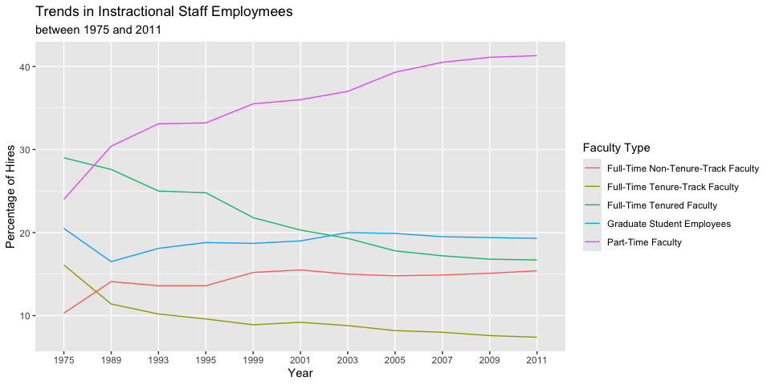
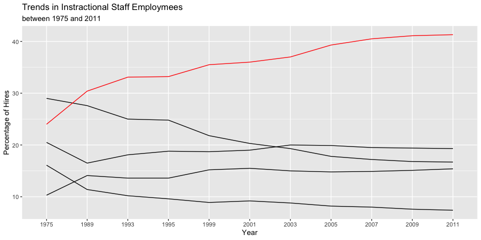
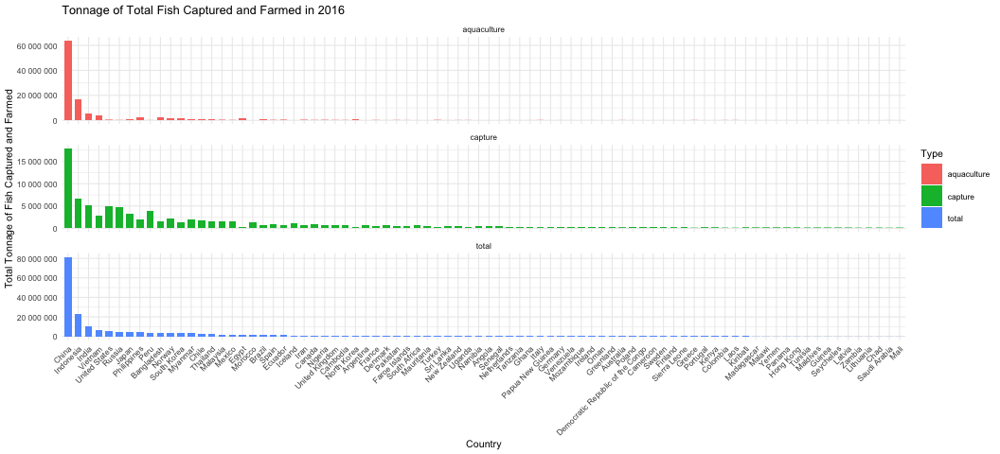

Lab 06 - Ugly charts and Simpson’s paradox
================
Olivia Zhang
02/27/2025

### Load packages and data

``` r
library(tidyverse) 
library(dsbox)
library(mosaicData) 

staff <- read_csv("data/instructional-staff.csv")
fisheries <- read_csv("data/fisheries.csv")

#wide to long
staff_long <- staff %>%
  pivot_longer(cols = -faculty_type, names_to = "year") %>%
  mutate(value = as.numeric(value))
```

### Exercise 1

``` r
staff_long %>%
  ggplot(aes(
    x = year,
    y = value,
    group = faculty_type,
    color = faculty_type
  )) +
  geom_line() +
  labs(title = "Trends in Instractional Staff Employmees", 
       subtitle = "between 1975 and 2011", 
       x = "Year", 
       y = "Percentage of Hires", 
       color = "Faculty Type")
```

<!-- -->

### Exercise 2

To make the porportion of part-time faculty pop up, I would change the
color of other faculty types to black.

``` r
staff_long %>%
  ggplot(aes(
    x = year,
    y = value,
    group = faculty_type,
    color = ifelse(faculty_type == "Part-Time Faculty", "red", "black")
  )) +
  geom_line() +
  labs(title = "Trends in Instractional Staff Employmees", 
       subtitle = "between 1975 and 2011", 
       x = "Year", 
       y = "Percentage of Hires", 
       color = "Faculty Type") +
  scale_color_identity() # Ensures colors are used directly
```

<!-- -->

``` r
#the general idea is right, but the color and legend are wierd.
```

### Exercise 3

The original graphs have a few problems: 1. The y axis of the density
plot is too stretch out because of the large capture and aquaculture
industry in China. One way to improve this is to use take the log of the
tonnage of fish farmed and captured so that the data from other
countries can be seen. 2. The pie chart is kind of uninformative and
conveys nothing new from the density plot. One way to improve this is to
create a histogram/barplot that shows the percentage of fish capture and
aquaculture for each country.

``` r
capture <- fisheries %>%
  filter(total >= 100000) %>%
#  ggplot(aes(x = fct_reorder(country, desc(total)), y = capture, group = capture)) +
  ggplot() +
  geom_point(aes(x = country, y = capture)) +
  geom_point(aes(x = country, y = aquaculture)) +
#  labs(
#    title = "Tonnage of Fish Captured and Farmed in 2016",
#    x = "Country",
#    y = "Total Tonnage of Fish Captured and Farmed") +
  scale_y_log10(labels = scales::label_number(accuracy = 1)) +
  theme(
    axis.text.x = element_text(angle = 45, hjust = 1) # Tilt x-axis ticks
  )
capture
```

    ## Warning in scale_y_log10(labels = scales::label_number(accuracy = 1)): log-10
    ## transformation introduced infinite values.

<!-- -->

``` r
aquaculture <- fisheries %>%
  filter(total >= 100000) %>%
  ggplot(aes(x = fct_reorder(country, aquaculture), y = aquaculture, color = "blue")) +
  geom_density() +
  labs(
    title = "Tonnage of Fish Captured and Farmed in 2016",
    x = "Country",
    y = "Total Tonnage of Fish Captured and Farmed") +
  scale_y_log10()


#capture + aquaculture +
#  position("dodge") +
#  labs(color = "Type")
```
